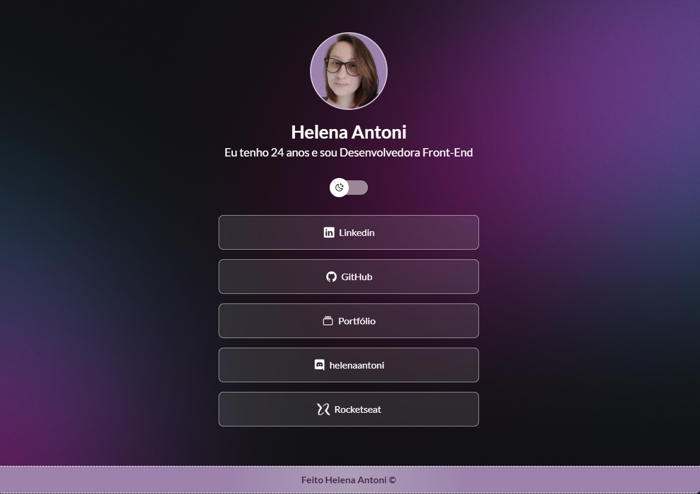
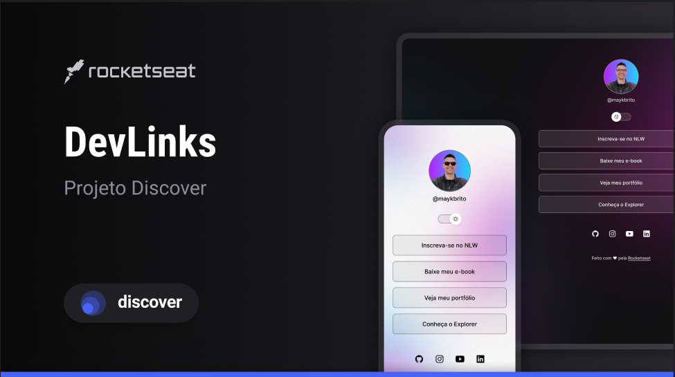

<h1 align="center"> Meus Links </h1>

  <a href="#-tecnologias">Tecnologias</a>&nbsp;&nbsp;&nbsp;|&nbsp;&nbsp;&nbsp;
  <a href="#-projeto">Projeto</a>&nbsp;&nbsp;&nbsp;|&nbsp;&nbsp;&nbsp;
  <a href="#-layout">Layout</a>&nbsp;&nbsp;&nbsp;|&nbsp;&nbsp;&nbsp;
  <a href="#memo-licença">Licença</a>

 
## 👩‍💻 Visualize o Projeto 

Visualize o projeto através deste [🔗 LINK ](https://helena-antoni.github.io/my-links/)
 
 

  

 

## 🚀 Tecnologias

Esse projeto foi desenvolvido com as seguintes tecnologias:

- HTML e CSS
- JavaScript 
- GIT e Github

## 💻 Projeto

O projeto Meus Links contém os Links de contato da dona do Repositório, Helena Antoni. 

- Possui um Layout Responsivo, para Dispositivos Móveis e para Desktops. 

- Também contém o modo noturno, e o diurno contendo alterações de cores na tela para uma maior acessibilidade.

## 🔖 Layout

Ele foi baseado neste figma, foram feitas algumas modificações de tamanho e cores no layout.

Você pode visualizar o layout através [DESSE LINK](https://www.figma.com/community/file/1187422022288947321). 

  

É necessário ter conta no [Figma](https://figma.com) para acessá-lo.

## :memo: Licença

Esse projeto está sob a licença MIT.

--- 